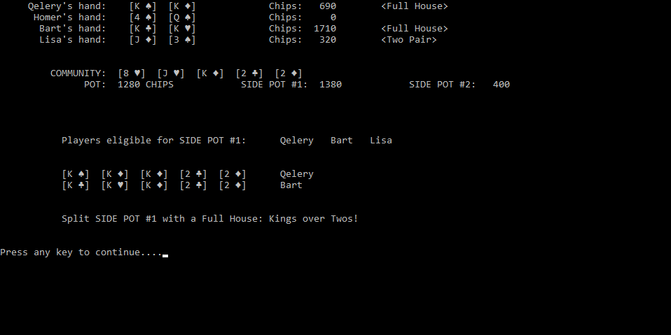

# Texas Hold 'Em Poker

Command line implementation of pot-limit Texas Hold 'Em Poker in Python.

# Game Features
* User choses the number of computer players, chips, amount of blinds
* Three basic random playing styles of computer players (will improve)
* Determines and displays winner of each hand
* Displays the best ranking hand of each player
* Displays kicker card used to break ties
* Handles multiple side pots when players go all-in
* Game ends when only one player has chips remaining

# Files

* main.py - main game classes
* handranker.py - functions for scoring players' hands
* display.py - functions for updating screen

