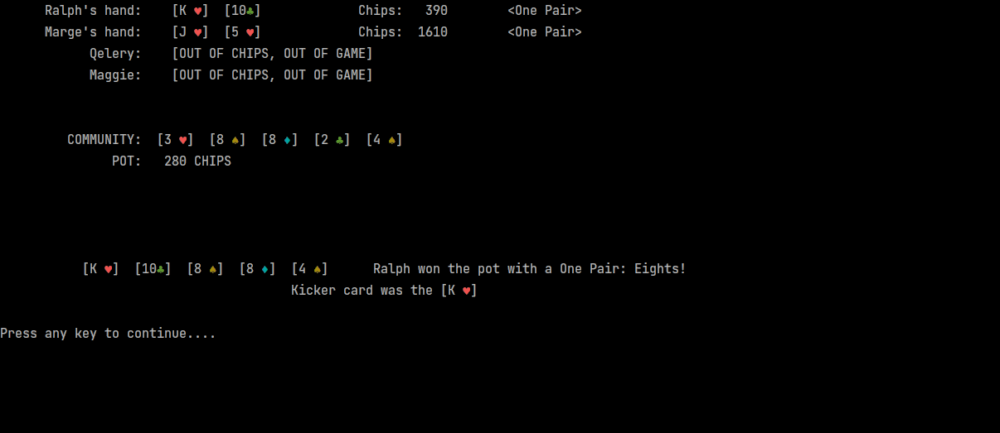

# Texas Hold 'Em Poker

Command line implementation of pot-limit Texas Hold 'Em Poker in Python.

# Note from 2022: 
Functionality is likely broke in some spots as I continue to refactor and unit test this project that was written back in 2019.

# Requirements
- Python 3.6+
- If running in Pycharm
  - Click `Run` | `Edit Configurations...`
  - Under 'Execution' check 'Emulate terminal in output console'

# Run
- Navigate to root of project folder
- Execute `> pip install -r requirements.txt`
- Execute `> python3 -m src.main`

# Game Features
* User chooses the number of computer players, chips, amount of blinds
* Three basic random playing styles of computer players (will improve)
* Determines and displays winner of each hand
* Displays the best ranking hand of each player
* Displays kicker card used to break ties
* Handles multiple side pots when players go all-in
* Game ends when only one player has chips remaining

## Screenshots

  

 

 

 

